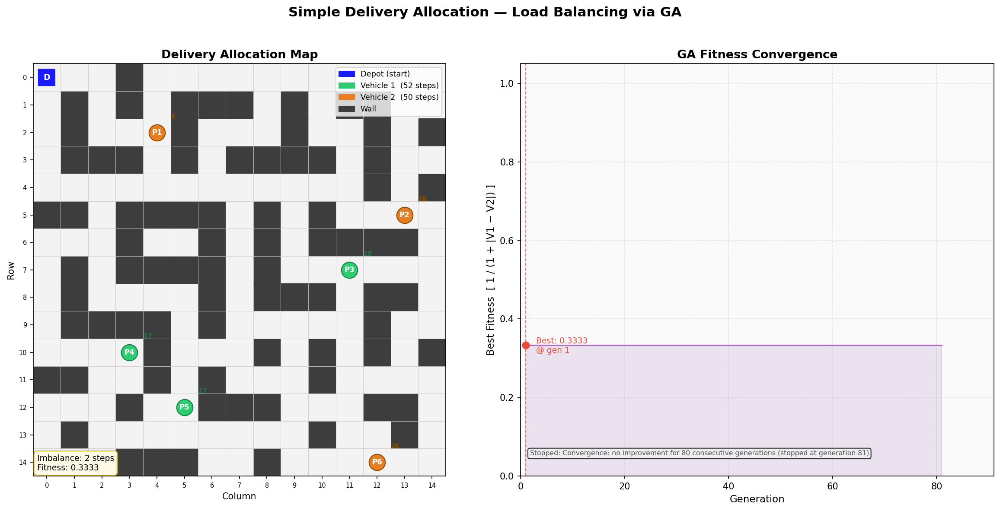

# PackSplit: Delivery Load Balancing using Genetic Algorithms

An AI-based optimization project that solves the **Delivery Allocation (Load Balancing) Problem** by combining **Breadth-First Search (BFS)** and a custom **Genetic Algorithm (GA)**.

## 📌 Problem Overview
A company has **6 delivery packages** and **2 vehicles** starting from a central **Depot** on a grid. The goal is to distribute the packages between the two vehicles such that their total travel workloads (shortest path distances on a grid containing walls) are as balanced as possible. This minimizes the imbalance:
$$\text{Imbalance} = | \text{Distance}_{\text{Vehicle 1}} - \text{Distance}_{\text{Vehicle 2}} |$$

---

## 🚀 Key Features

### 1. Grid Environment & Shortest Path Finding (BFS)
* Evaluates distances on a **15×15 2D grid** with wall obstacles.
* Uses **Breadth-First Search (BFS)** to guarantee finding the exact shortest paths from the Depot to each of the 6 delivery points.
* Explains why BFS (which guarantees optimality on unweighted graphs) is preferred over DFS for distance computation.

### 2. Genetic Algorithm (GA) Optimization
* **Chromosome Representation**: Binary representation (6-bit array, where `0` assigns the package to Vehicle 1, and `1` assigns it to Vehicle 2).
* **Fitness Function**: Maximizes $1 / (1 + \text{Imbalance})$, transforming the minimization problem into a positive range $(0, 1]$ suitable for selection.
* **Selection**: Tournament Selection (size $k = 5$), which maintains healthy selection pressure while avoiding premature convergence.
* **Crossover**: One-Point Crossover to preserve building blocks on short chromosomes.
* **Mutation Types (Lecture-inspired)**:
  * *Random Mutation*: Flips a single random bit.
  * *Swap (Inorder) Mutation*: Swaps two random bits (preserving structural allocation balance).
  * *Gaussian Mutation*: Adds Gaussian noise to a float representation, applying a sigmoid function, and thresholding back to binary (probabilistic soft-flip).

### 3. Termination Conditions
The algorithm terminates when any of the following triggers:
1. **Max Iterations**: Reaching a hard limit of `NUM_GENERATIONS` (400 generations).
2. **Convergence**: Early stopping when the best fitness does not improve for `PATIENCE` (80 generations).
3. **Target Found**: Stopping immediately upon finding a perfect balance (fitness = `1.0`).

### 4. Interactive Visualizations
Generates a side-by-side plot showcasing:
* **Delivery Allocation Map**: Grid visual showing the Depot, walls, and color-coded package allocations for both vehicles.
* **GA Fitness Convergence**: An evolutionary curve showing how fitness improves over generations until termination.

---

## 📁 Repository Structure
* `delivery_allocation.py`: The main program containing the BFS, Genetic Algorithm engine, and Matplotlib plotting logic.
* `testing_understanding.py`: A scratchpad script containing mutation implementations.
* `AI_Project_Final_Report.pdf`: Final academic project report.
* `AI_Project_Report.pdf` & `AI_Project_Report.docx`: Project report documentation drafts.
* `delivery_allocation_results.png`: Saved visualization plot output.

---

## 🛠️ How to Run
Ensure you have the required Python packages installed:
```bash
pip install numpy matplotlib
```

Run the main allocation script:
```bash
python delivery_allocation.py
```

---

## 📊 Sample Output Visualization
Below is the visualization of the balanced vehicle route allocation and the fitness convergence curve:



